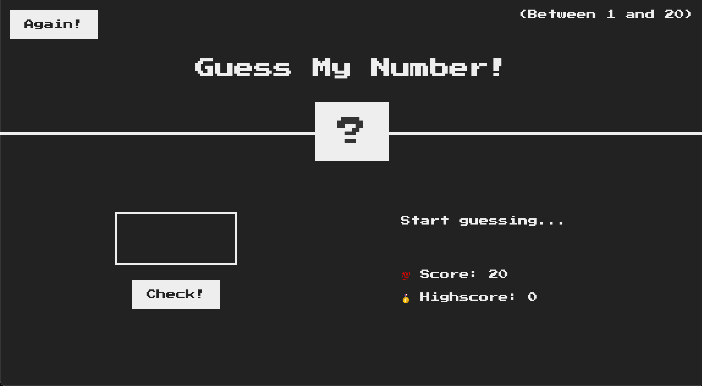

# GitHub Pages

https://kkyhh.github.io/JavaScript_DOM_Events/



### 설명

JavaScript의 DOM 과 Events Fundamentals를 사용해본다

---

### DOM ( 문서 객체 모델 )

HTML 문서를 구조적으로 나타내는것
DOM은 JavaScript를 이용해 HTML 요소와 스타일에 액세스해 조작할 수 있게 한다

---

### DOM Tree Structure

웹 브라우저가 HTML 문서를 로드할 때 문서 내의 요소와 해당 관계를 나타내는 개체의 트리형 구조를 만든다

이 트리 구조를 DOM 트리라고 한다
각 HTML 요소는 트리의 노드가 된다

```html
<!DOCTYPE html>
<html>
  <head>
    <title>Sample Page</title>
  </head>
  <body>
    <div id="container">
      <h1>Hello, World!</h1>
      <p>This is a sample paragraph.</p>
    </div>
  </body>
</html>
```

- `<html>` 요소는 루트 노드
- `<head>` 및 `<body>`는 `<html>`의 하위 노드
- `<title>`은 `<head>`의 하위 노드
- `<div>`는 `<body>`의 하위 노드
- `<h1>` 및 `<p>`는 `<div>`의 하위 노드

---

### JavaScript 와 DOM의 관계

JavaScript는 DOM과 상호 작용하여 웹페이지의 콘텐츠, 구조 및 스타일을 동적으로 업데이트 한다. 브라우저는 현재 웹페이지의 DOM을 나타내는 '문서'라는 전역 개체를 노출한다. JavaScript를 사용하여 요소에 액세스하고 조작을 한다

```javascript
const heading = document.querySelector('h1');
heading.textContent = 'Hello, New World!';
```

여기서 `document.querySelector('h1')`는 `<h1>` 요소를 검색하고 `textContent`는 해당 텍스트를 변경하는 데 사용된다

---

### ✅ DOM !== JavaScript

DOM은 JavaScript가 아니라는 점을 기억해야 한다. 이는 브라우저에서 생선된 웹 문서를 표현한 것

DOM과 상호 작용할 수 있는 수단을 제공하지만 DOM은 별개의 개체이다.
DOM은 브라우저 인터페이스고 JavaScript는 프로그래밍 언어이다.
JavaScript 코드는 DOM을 조작하여 동적이고 대화형 웹 페이지를 만든다.

요약

- DOM은 메모리의 HTML 문서를 나타내는 계층적 트리구조
- JavaScript는 `document` 개체를 사용하여 이 트리 구조와 상호작용 하므로 반응형 및 대화형 웹 애플리케이션을 만들 수 있다

---

### 기록

---

`use strict` 엄격모드

```javascript
'use strict';
```

ECAMAScript 5 (ES5)에 도입된 리터럴표현식

일반적인 코딩 오류를 촥하고 오류가 발생하기 쉬운 특정 기능의 사용을 방지해 최적화된 JavaScript를 작성하는데 도움을 준다

---

`let` 과 `const`

```javascript
let secretNumber = Math.trunc(Math.random() * 20) + 1;
let score = 20;
let highScore = 0;
```

고정되지 않고 변경될 값인 경우에 let으로 지정을 해주자.
알면서도 습관적으로 const로 지정하고 왜 적용이 안되는지 고민을 해본적이 있다.

---

`function`

```javascript
const displayMessage = function (message) {
  document.querySelector('.message').textContent = message;
};

displayMessage('blahblah');
```

반복되는 코드는 함수로 만들어 코드를 리팩토링하는것이 좋다.
항상 반복되는것이 있는지 확인을 해보자

---

`document.querySelector`

```javascript
document.querySelector('body').style.backgroundColor = '#222';
document.querySelector('.number').style.width = '15rem';
document.querySelector('.score').textContent = 20;
```

document.querySelector를 사용해 HTML의 클래스값이나 body 값도 조정을 할 수 있다 text를 변환시키거나 style도 바꾼다. CSS를 적용시키는 방식과 조금 비슷하다

---

`addEvnetListener`

```javascript
document.querySelector('.check').addEventListener('click', function () {
  const guess = Number(document.querySelector('.guess').value);
```

addEventListener를 사용하여 요소에 설정할 수 있다. 위 코드는 check 클래스에 클릭 이벤트를 설정하고 guess 클래스의 값을 검색후 숫자로 변환 후 `guess` 변수에 저장한다.

React의 JSX `onClick`과 비슷한 느낌이다

---

if 문 안에 if 문

```javascript
 if (!guess) {
    displayMessage('❌ No number!');
  } else if (guess === secretNumber) {
    displayMessage('👍 You did it!')
    document.querySelector('body').style.backgroundColor = '#60b347';
    document.querySelector('.number').style.width = '30rem';
    document.querySelector('.number').textContent = secretNumber;
    if (score > highScore) {
      highScore = score;
      document.querySelector('.highscore').textContent = highScore;
    }
```

if 문 안에서 `else if`나 `else`로 넘어가지 않고 다른 if문을 또 사용할 수 있다는걸 알았다. 복잡한 논리가 적용될 때 잘 고민해보면 좋을것 같다.

---

삼항 연산자 `condition ? exprIfTrue : exprIfFalse;
`

```javascript
 if (score > 1) {
      displayMessage(guess > secretNumber ? 'Too high !' : 'Too low !')
```

첫 프로젝트를 할 때 ? : 보고 당황한적이 있었다. 조건이 `true`라면 ? 값을 `false`라면 : 값을 사용한다. 굉장히 유용하게 많이 사용되는 연산자 같다

---

`Math`

```javascript
secretNumber = Math.trunc(Math.random() * 20) + 1;

Math.trunc();
Math.random();
```

JavaScript의 Math 함수

Math.trunc

- 주어진 숫자에 정수부분만 반환한다

Math.random

- 0 이상 1 미만의 수를 랜덤하게 반환한다
- 기본값이 0~1 사이의 난수 이기 때문에 원하는 값에 따라 수를 곱하거나 더해주어야 한다

EX)

1 - 20의 난수를 원한다면
`Math.random()*20` = 0 ~ 19
`Math.random()*20 + 1` = 1 ~ 20
